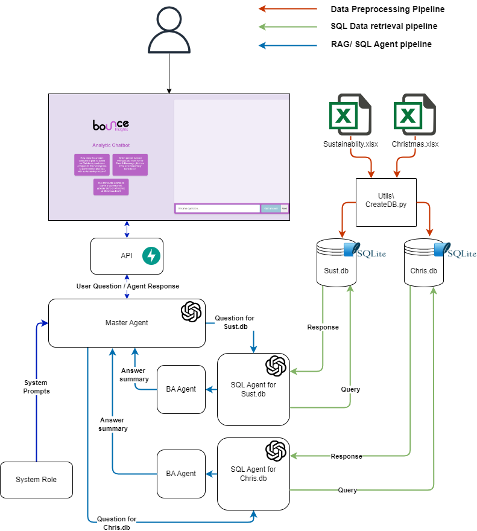
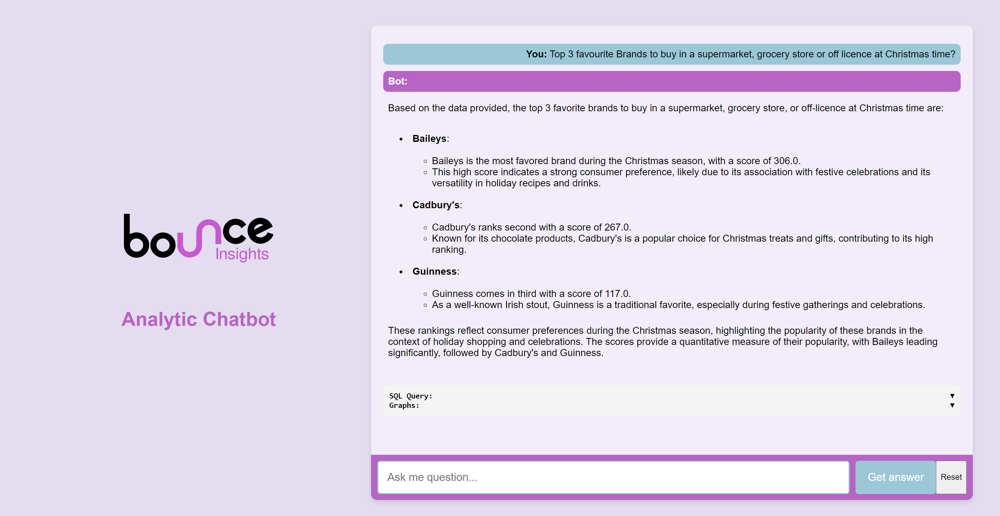

# Survey Data Analyst


`Survey Data Analyst` is a chatbot project that utilizes <u>GPT 4o</u>, <u>Langchain</u>, <u>SQLite</u>, and <u>SQLAlchemy</u> allows users to interact (perform <u>Q&A</u> and <u>RAG</u>) with Survey dataset files using natural language. 


## Features:

- Chat with CSV and XLSX data.
- Quality AI-generated insights and comparisons between both datasets.
- RAG with Tabular datasets.
- Visualisation of insights and comparisons.


## Main underlying techniques used in this chatbot:
- LLM chains and agents.
- Fast API as a web framework.
- SQL agent from langchain community.
- SQLite3 for database management.
- Render for deployment.

## Models used in this chatbot:
- GPT-4o: [Website](https://platform.openai.com/docs/models)

## Requirements:
- Operating System: Linux OS or Windows. (I am running the project on windows)
- OpenAI Credentials: Required for GPT functionality.
- Install SQLite3 [Link](https://www.sqlite.org/download.html).

## Folder Structure
```
DataAnalyst/
├── core/
│   ├── __init__.py
|   ├── analyst.py
│   └── agent.py
├── Data/
│   ├── DB/
│   └── Files/
├── FastAPI_Wrapper/
|   ├──static/
|   ├── __init__.py
|   ├── server.py
|   └── index2.html
├── Utils/
|   ├── CreateDb.py
|   └── DB_test.py
|
├── Definations.py
├── .gitignore
├── requirements.txt
└── README.md
```


## Installation:
- Ensure you have Python installed along with required dependencies.
```
git clone <the repository>
cd DataAnalyst
python3 -m venv llm_venv
./bin/activate
pip install -r requirements.txt
```
## Execution:

1. Create `.env` file in which store all API keys 
```
OPENAI_API_KEY = XXXXXXXXXXXXXXXXXXXXXX
HF_API_KEY = XXXXXXXXXXXXXXXXXXXX
```

2. Activate vertual enviroment :

```cmd
cd <path_to_folder>
.\bin\activate
```

3. Run FastAPI on dev mode:
```cmd
fastapi dev FastAPI_Wrapper\server.py
```

4. Go to localhost ``127.0.0.1:8000/`` to accesss site.


## Project Schema
<div align="center">
  
</div>

## Chatbot User Interface
<div align="center">
  
</div>

## Databases:
**Dataset 1 (Sustainability Research Results)** - This dataset is an Excel file containing an NxN
breakdown of the results to a survey commissioned by Bounce Insights asking consumers in the
UK various questions around how important is sustainability to consumers when they are buying
products in general & how engaged are consumers with sustainable brands or products.

**Dataset 2 (Christmas Research Results)** - This dataset is an Excel file containing an NxN
breakdown of the results to a survey commissioned by Bounce Insights asking consumers in
Ireland various questions to understand the consumers' plans for Christmas, what their plans are
overall and with spending.


## Key frameworks/libraries used in this chatbot:
- Python 3.11.3: [Documentation](https://www.python.org/downloads/release/python-3113/) 
- Langchain: [introduction](https://python.langchain.com/docs/get_started/introduction)
- OpenAI: [Developer quickstart](https://platform.openai.com/docs/quickstart?context=python)
- SQLAlchemy [Documentation](https://www.sqlalchemy.org/)